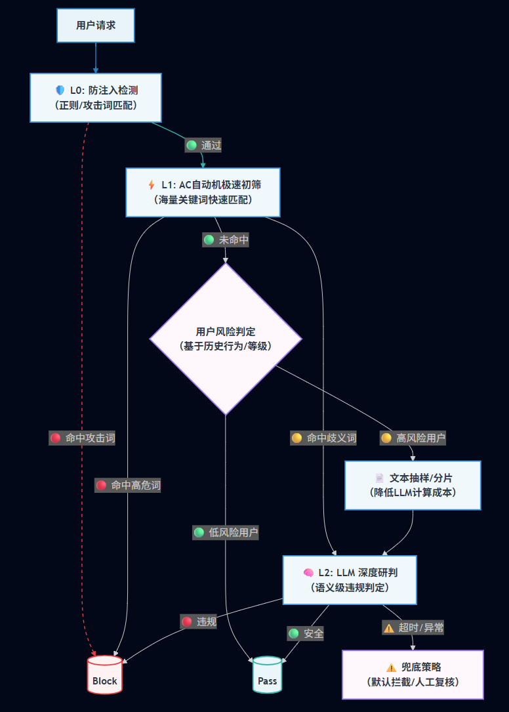

# 🛡️ ContentGuard Pro —— 基于 "AC自动机 + LLM" 的高性能企业级内容安全风控系统

**ContentGuard Pro** 是一套专为社区、评论、即时通讯等高并发场景设计的内容安全检测服务。它采用 **"漏斗式"分层防御架构**，在毫秒级拦截 90% 明显违规内容的同时，利用大语言模型（LLM）的语义理解能力处理复杂的歧义内容和上下文攻击，实现了**成本、性能与准确率**的完美平衡。

## 🏗️ 核心架构 (Architecture)

系统采用三层防御体系，由 `SecurityOrchestrator` 进行全链路异步编排：



## ✨ 核心特性 (Key Features)

* **⚡ 极致性能 (High Performance)**
  * **L1 极速初筛**: 基于 **Aho-Corasick** 算法，支持百万级敏感词库的毫秒级匹配。
  * **全链路异步**: 基于 `CompletableFuture` 实现，IO 密集型（LLM调用）与 CPU 密集型（AC匹配）任务线程池隔离。
* **🧠 智能研判 (AI Powered)**
  * **多模型支持**: 原生适配 **DeepSeek**、**通义千问 (Qwen)** 及 OpenAI 格式接口。
  * **Prompt 注入防御**: 内置规则库，防止用户通过 "忽略指令" 等方式绕过审核。
  * **智能抽样**: 针对长文本自动提取 "开头-中间随机-结尾" 进行检测，大幅降低 Token 消耗。
* **🛡️ 高可用设计 (Reliability)**
  * **多 Key 轮询**: 支持配置 LLM API Key 池，自动轮询负载，避免单 Key 限流。
  * **分布式限流**: 基于 Redis Lua 脚本实现精准的 API 速率限制。
  * **自动降级**: LLM 服务不可用时，自动回退至兜底策略（根据历史标记或严格模式处理）。
* **🔄 动态热更新 (Hot Reload)**
  * 支持敏感词库的定时自动热加载（默认 5 分钟），无需重启服务即可生效。

## 🛠️ 技术栈 (Tech Stack)

* **核心框架**: Spring Boot 3.2.0
* **数据存储**: MySQL 8.0 + Spring Data JPA
* **缓存/限流**: Redis + Lua
* **算法引擎**: Aho-Corasick Algorithm
* **网络通信**: OkHttp 4
* **工具库**: Lombok, FastJSON2

## 🚀 快速开始 (Getting Started)

### 1. 环境准备

* JDK 17+
* MySQL 5.7+
* Redis 6.0+
* Maven 3.6+

### 2. 数据库初始化

创建数据库 `safe_detection` 并导入表结构：

```sql
CREATE DATABASE `safe_detection` DEFAULT CHARACTER SET utf8mb4;

-- 运行 src/main/sql/create.sql 中的脚本
-- 创建 sensitive_words 表结构及预置数据
```

### 3. 应用配置

修改 `src/main/resources/application-dev.yml` (或创建 `application.yml`)：

```yml
spring:
  datasource:
    username: root      # 你的数据库账号
    password: password  # 你的数据库密码
  data:
    redis:
      host: localhost
      password: password  # 你的 Redis 密码

content-guard:
  llm:
    api-keys: 
      - "sk-xxxxxxxxxxxxxxxx"  # 填入你的 LLM API Key
      - "sk-xxxxxxxxxxxxxxxx"
    model: "deepseek-chat"     # 或 "qwen-plus"
```

### 4. 编译与运行

```bash
# 编译打包
./mvnw clean package

# 启动服务
java -jar target/content-guard-pro-1.0.0-RELEASE.jar
```

## 🔌 API 文档 (API Reference)

### 内容检测接口

**Endpoint**: `POST /api/v1/content/check`

#### 请求参数 (Request)


| 参数名        | 类型   | 必填 | 描述                               |
| ------------- | ------ | ---- | ---------------------------------- |
| `userId`      | String | 是   | 用户唯一标识，用于限流和风险画像   |
| `riskLevel`   | Enum   | 是   | 用户风险等级:`HIGH`,`MEDIUM`,`LOW` |
| `title`       | String | 否   | 内容标题                           |
| `fullContent` | String | 是   | 待检测的完整文本内容               |

**示例 JSON**:

```
{
  "userId": "user_9527",
  "riskLevel": "MEDIUM",
  "title": "测试评论",
  "fullContent": "这里是用户发布的内容，包含可能的敏感词..."
}
```

#### 响应参数 (Response)


| 参数名           | 类型    | 描述                                                     |
| ---------------- | ------- | -------------------------------------------------------- |
| `isSafe`         | Boolean | `true`为安全，`false`为违规                              |
| `detectStrategy` | String  | 触发的最终检测策略 (e.g.,`Quick-Pass`,`Ambiguous-Check`) |
| `detectTime`     | Long    | 检测耗时 (ms)                                            |
| `riskReason`     | Array   | 违规详情，包含类型和片段                                 |

**示例 JSON (违规)**:

```
{
  "isSafe": false,
  "userId": "user_9527",
  "detectStrategy": "Ambiguous-Check",
  "detectTime": 450,
  "riskReason": [
    {
      "sensitiveType": "LLM_DETECTED_POLITICAL",
      "sensitiveFragment": "涉及违规的具体文本片段"
    }
  ]
}
```

## ⚙️ 高级配置 (Configuration)

你可以通过 `application.yml` 调整系统行为：


| 配置项                                            | 默认值 | 说明                       |
| ------------------------------------------------- | ------ | -------------------------- |
| `content-guard.text.premium-threshold`            | 500    | 触发抽样检测的字符长度阈值 |
| `content-guard.security.ac-refresh-rate-ms`       | 300000 | 敏感词库热更新间隔 (ms)    |
| `content-guard.llm.rate-limit.permits-per-second` | 20     | LLM 接口请求速率限制 (QPS) |
| `content-guard.async.io.max-pool-size`            | 50     | LLM 并发调用最大线程数     |

